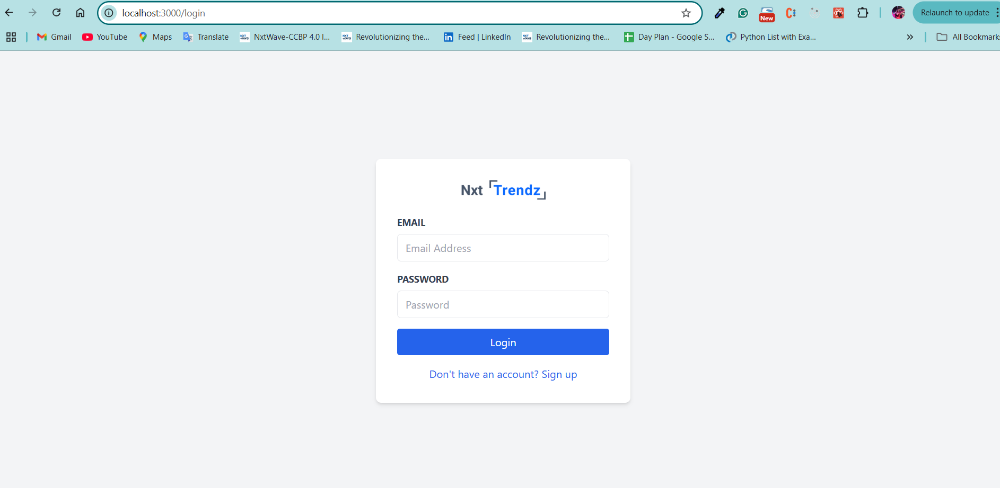
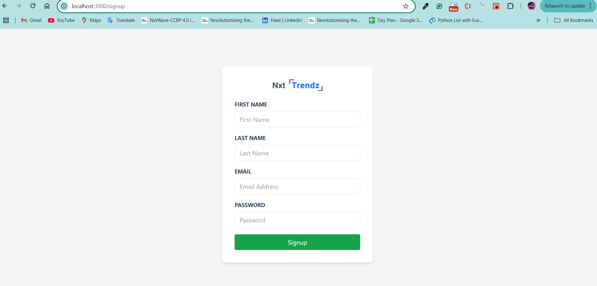
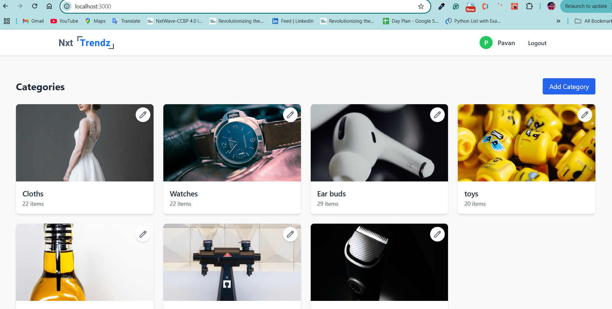
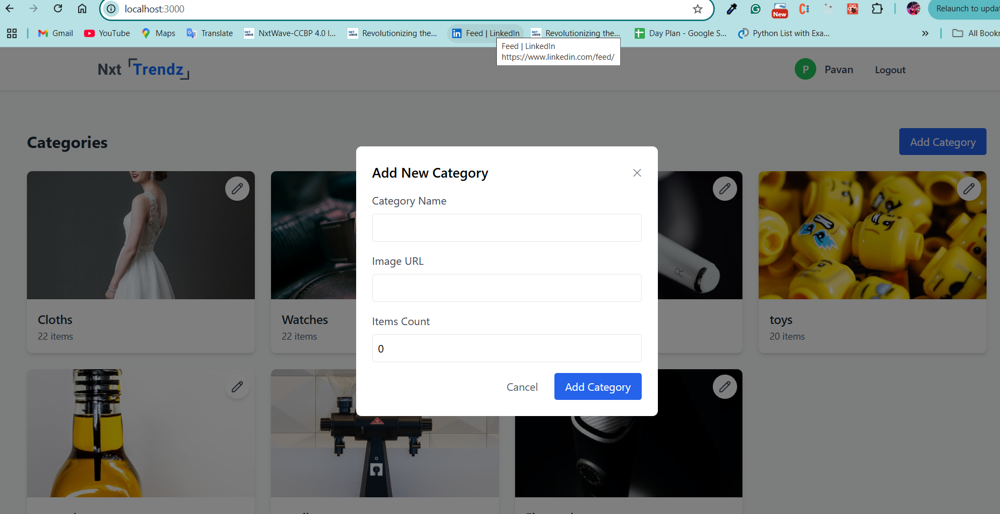
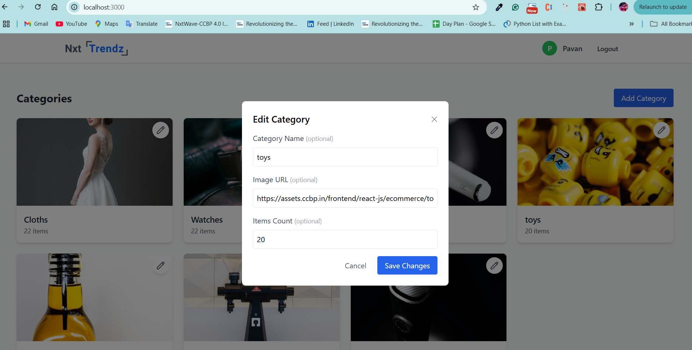

# Category Management System

A full-stack web application for managing categories with user authentication and CRUD operations. This application allows users to manage categories with features like adding, editing, and viewing categories in a responsive grid layout.

## 📚 Tech Stack

### Frontend

- **React.js** (v18) - Modern UI library
- **TailwindCSS** - Utility-first CSS framework
- **React Router v6** - Client-side routing
- **js-cookie** - Cookie management

### Backend

- **Node.js** (v14+) - Runtime environment
- **Express.js** - Web framework
- **MongoDB** - Database
- **Mongoose** - ODM for MongoDB
- **JWT** - Authentication
- **bcrypt** - Password hashing
- **cors** - Cross-origin resource sharing

## 🚀 Features

### User Management

- ✅ User registration with email verification
- ✅ Secure login with JWT
- ✅ Password hashing with bcrypt
- ✅ Protected routes and API endpoints
- ✅ Persistent sessions with cookies

### Category Management

- ✅ CRUD operations for categories
- ✅ Items count tracking
- ✅ Real-time updates

### UI/UX Features

- ✅ Responsive design
- ✅ Loading states
- ✅ Error handling
- ✅ Form validation
- ✅ Modal dialogs

## 🛠️ Installation & Setup

### Prerequisites

- Node.js (v14 or higher)
- MongoDB Atlas URI
- npm/yarn package manager

### Backend Setup

1. Navigate to backend directory:

```bash
cd backend
```

2. Install dependencies:

```bash
npm install
```

3. Create .env file:

```env
MONGO_URI=mongodb+srv://<username>:<password>@mycluster.axjo7.mongodb.net/<DatabaseName>?retryWrites=true&w=majority&appName=MyCluster
JWT_PRIVATE_KEY=<YOUR_JWT_PRIVATE_KEY>
PORT=5000
FRONTEND_URL=http://localhost:3000
```

4. Start the server:

```bash
npm start
```

### Frontend Setup

1. Navigate to frontend directory:

```bash
cd frontend
```

2. Install dependencies:

```bash
npm install
```

3. Create .env file:

```env
REACT_APP_API_URL=http://localhost:5000
```

4. Start the development server:

```bash
npm start
```

## 📁 Project Structure

```
category-management/
├── backend/
│   ├── src/
│   │   ├── controllers/
│   │   │   ├── authController.js
│   │   │   └── categoryController.js
│   │   ├── models/
│   │   │   ├── userModel.js
│   │   │   └── categoryModel.js
│   │   ├── routes/
│   │   │   ├── authRoutes.js
│   │   │   └── categoryRoutes.js
│   │   ├── middleware/
│   │   │   ├── auth.js
│   │   │   └── errorHandler.js
│   │   ├── config/
│   │   │   └── database.js
│   │   └── app.js
│   ├── package.json
│   └── .env
│
└── frontend/
    ├── src/
    │   ├── components/
    │   │   ├── |
    │   │   │   ├── Login.js
    │   │   │   └── Signup.js
    │   │   ├── |-  Category.js
    │   │   │   ├── CategoryCard.js
    │   │   │   ├── AddCategoryModal.js
    │   │   │   └── EditCategoryModal.js
    │   │   ├── |--Header.js
    │   │   └── | --Dashboard.js
    │   ├── config/
    │   │   └── constants.js
    │   └── App.js
    ├── package.json
    └── .env
```

## 🔗 API Endpoints

### Authentication

```
POST /api/auth/signup
- Register new user
Request: { firstName, LastName, emailId, password }
Response: { success, message }

POST /api/auth/login
- Login user
Request: { emailId, password }
Response: { success, token, user }
```

### Categories

```
GET /api/category
- Get all categories
Response: { success, categories: [...] }

POST /api/category
- Create new category
Request: { name, imageUrl, itemsCount }
Response: { success, message }

PUT /api/category/:id
- Update category
Request: { name?, imageUrl?, itemsCount? }
Response: { success, message }

```

## 💻 Development

### Backend Development

- Uses Express.js for routing
- MongoDB with Mongoose for data modeling
- JWT for authentication
- Error handling middleware
- Input validation
- CORS enabled

### Frontend Development

- React functional components with hooks
- Protected routes with React Router
- Form validation
- Error boundaries
- Responsive design with Tailwind
- Modal components for forms

## 🔒 Security Features

- Password hashing
- JWT token authentication
- Protected API routes
- XSS protection
- CORS configuration
- Input validation
- Error handling

## 📝 Environment Variables

### Backend (.env)

## 🚀 Deployment

1. Build frontend:

```bash
cd frontend
npm run build
```

2. Start backend:

```bash
cd backend
npm start
```

## 📸 Screenshots

### Login Page


The login page features:

- Clean and modern design
- Email and password authentication
- Error handling with visual feedback
- Link to signup for new users
- Remember me functionality

### Signup Page


The signup page includes:

- User-friendly registration form
- First name and last name fields
- Email validation
- Password strength requirements
- Smooth navigation to login

### Home Page (Dashboard)


The dashboard showcases:

- Responsive grid layout of categories
- User profile information in header
- Add category button
- Category cards with images
- Clean and modern UI design

### Add Category Modal


The add category modal features:

- Form for creating new categories
- Items count field
- Validation feedback
- Loading states during submission

### Edit Category Modal


The edit modal includes:

- Pre-filled category information
- Optional field updates
- Real-time validation
- Success/error notifications
